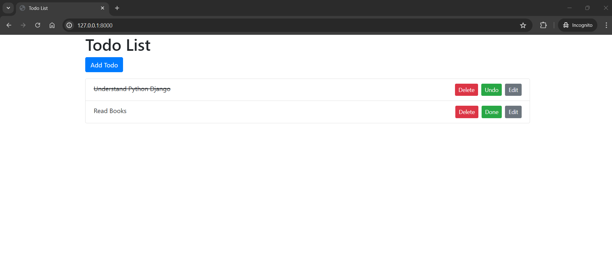
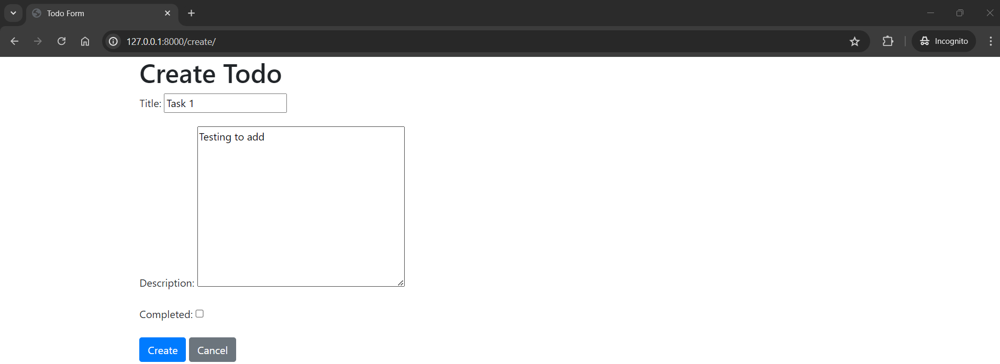
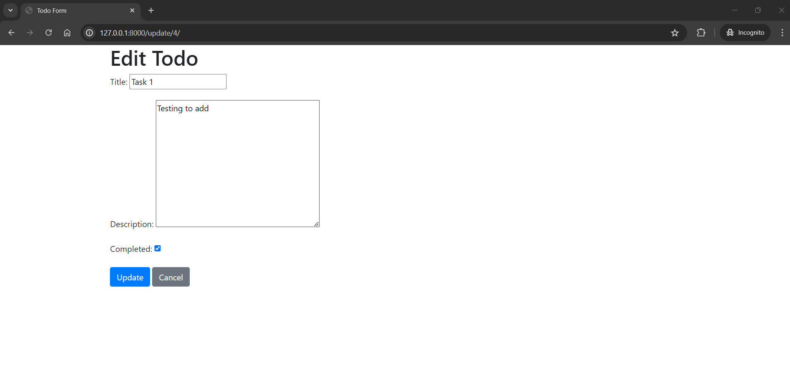
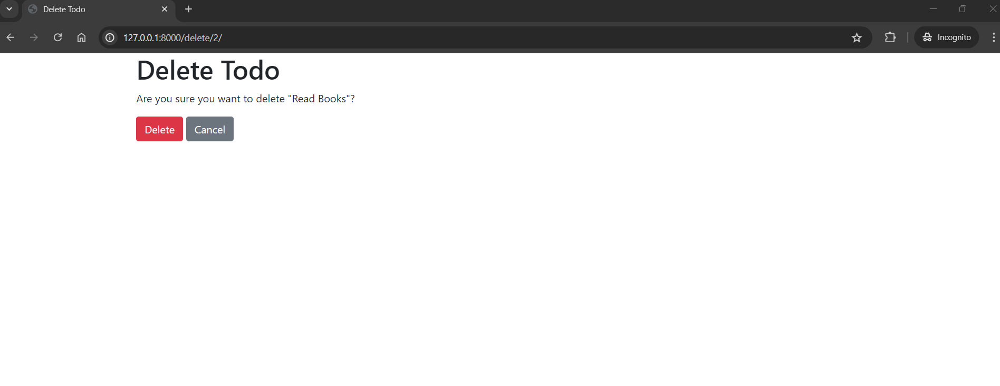

# Django Todo App

A simple Todo web application built with Django and styled with Bootstrap. This app allows users to create, edit, delete, and mark tasks as completed.

## Features

- Add new tasks
- Edit existing tasks
- Delete tasks
- Mark tasks as completed or incomplete
- Responsive design with Bootstrap

## Requirements

- Python 3.12
- Django 5.0.6 or later
- Bootstrap 4.5 or later

## Installation

1. **Clone the repository:**
   ```bash
   git clone https://github.com/your-username/django-todo-app.git
   cd django-todo-app
2. **Create and activate a virtual environment:**
   ```bash
   python -m venv venv
   source venv/bin/activate   # On Windows use `venv\Scripts\activate`
3. **Install the dependencies:**
   ```bash
   pip install -r requirements.txt
4. **Apply migrations:**
   ```bash
   python manage.py makemigrations
   python manage.py migrate
5. **Run the development server:**
   ```bash
   python manage.py runserver
6. Open your browser and visit:
   http://127.0.0.1:8000/

## Output








##Contributing

Feel free to fork this repository, make changes, and submit a pull request.

You can modify the repository URL in the installation section to match your GitHub repository URL. This README provides clear instructions for setting up the project locally, making it easy for others to contribute and use the application.
Developed by Gaurav Mazumder
